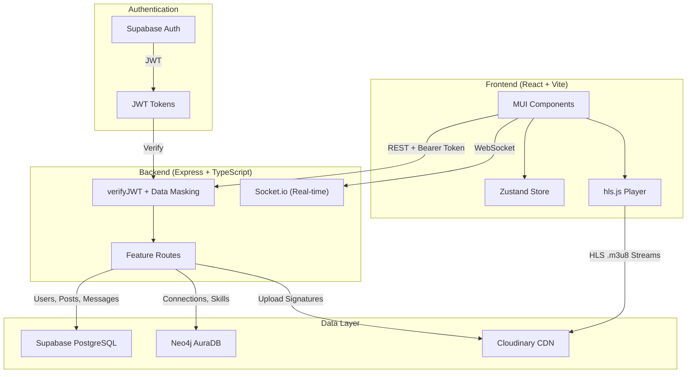

# DemoDay — System Architecture

> A visual-first professional networking platform for tech talent.

## Architecture Overview

When a candidate logs into **DemoDay**, their authentication session is verified globally by Supabase client-side using JWT tokens. As they scroll through their Home Feed, a fast cursor-paginated request fires to the Express API, pulling compressed HLS video assets streamed from Cloudinary CDN edge locations. When they interact or establish deep connections, a microservice writes to Neo4j AuraDB, keeping standard structural calculations off the relational database. This separation of layers ensures zero hosting costs while setting up a perfectly clean interface pattern for a modular swap-out to a React Native application down the road.

## System Flow



## Monorepo Structure

```
DemoDay/
├── apps/
│   ├── client/          # React + Vite + MUI + Zustand
│   └── server/          # Express + TypeScript + Socket.io
├── packages/
│   └── shared/          # Shared TypeScript types & constants
├── database/
│   ├── migrations/      # PostgreSQL migration scripts
│   └── neo4j/           # Cypher schema definitions
├── package.json         # npm workspaces root
└── .env.example         # Environment variable template
```

## Tech Stack

| Layer | Technology | Purpose |
|---|---|---|
| Frontend | React, Vite, TypeScript | UI framework & tooling |
| Styling | Material-UI (MUI) v6 | Component library & design system |
| State | Zustand | Global client state management |
| Auth | Supabase | Email/Password + GitHub OAuth |
| API | Express, TypeScript | REST API + WebSocket server |
| Primary DB | Supabase PostgreSQL | Users, posts, messages (with RLS) |
| Graph DB | Neo4j AuraDB | Connections, skills, talent mapping |
| Media CDN | Cloudinary | Video compression, HLS, image delivery |
| Real-time | Socket.io | Chat messaging |
| Deployment | Vercel (client) + Render (server) | Zero-cost hosting |
